## 📱 AgriSense AI Mobile

**Mobile App for Plant Identification and Crop Disease Detection**

AgriSense AI Mobile is the React Native/Expo mobile application for the AgriSense AI system. The app allows users to capture or upload crop leaf images, send them to the AgriSense AI FastAPI backend, and receive crop identification and disease or pest detection results.

The mobile app is designed for farmers, students, researchers, agricultural extension workers, and smart agriculture users who need quick and accessible crop health support from a mobile device.

## 🌿 What the App Does

AgriSense AI Mobile follows a two-stage AI prediction workflow:

```text
Leaf Image
   ↓
Plant Identification
   ↓
Crop-Specific Disease Detection
   ↓
Prediction Results + Confidence Scores
   ↓
Optional Grad-CAM Visual Explanation
```

The app first identifies the crop type, such as **Cashew**, **Cassava**, **Maize**, or **Tomato**. After that, the backend automatically selects the correct crop-specific disease model to detect whether the leaf is healthy or affected by a disease or pest.

## ✨ Features

- Capture leaf images using the camera
- Upload leaf images from the gallery
- Predict crop type from leaf images
- Detect crop disease, pest damage, or healthy condition
- Display plant prediction confidence scores
- Display disease prediction confidence scores
- Enable or disable Explainable AI
- View Grad-CAM explanation images
- Save prediction history
- View recent prediction history
- Read crop and disease explanation content
- Access crop health tips
- Manage app preferences from settings

## 🧠 Supported Crops and Classes

### Plant Identification

```ts
["Cashew", "Cassava", "Maize", "Tomato"];
```

### Crop-Specific Classes

| Crop    | Supported Classes                                                                     |
| ------- | ------------------------------------------------------------------------------------- |
| Cashew  | anthracnose, gumosis, healthy, leaf miner, red rust                                   |
| Cassava | bacterial blight, brown spot, green mite, healthy, mosaic                             |
| Maize   | fall armyworm, grasshoper, healthy, leaf beetle, leaf blight, leaf spot, streak virus |
| Tomato  | healthy, leaf blight, leaf curl, septoria leaf spot, verticulium wilt                 |

> The class names match the trained backend model labels to preserve class-index mapping.

## 📸 App Screenshots

The screenshots are stored in the root project [`screenshots`](../screenshots) folder.

### Onboarding

<p align="center">
  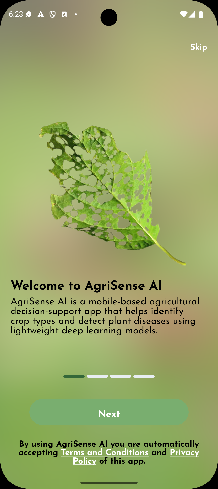
  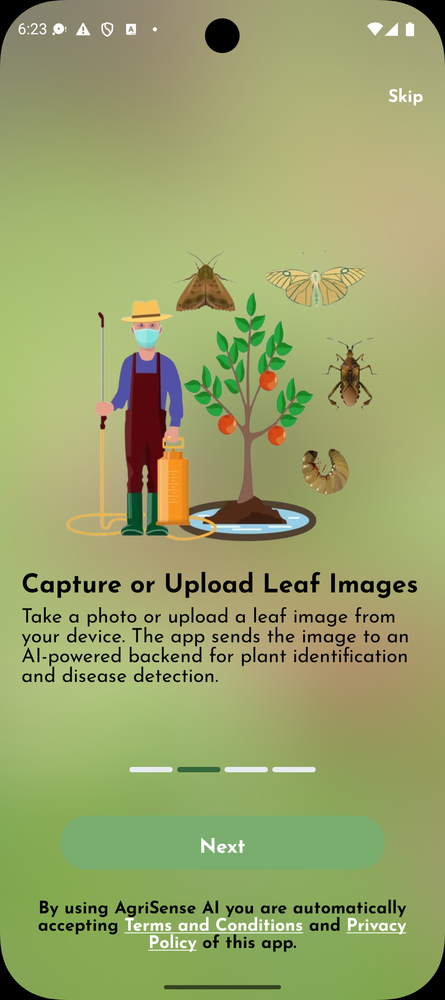
  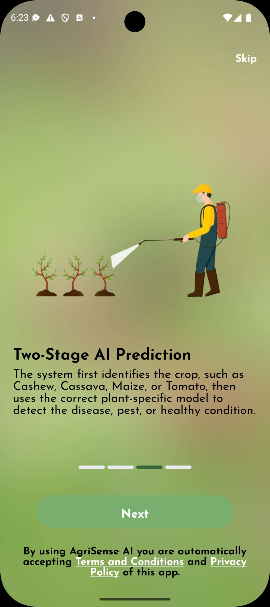
  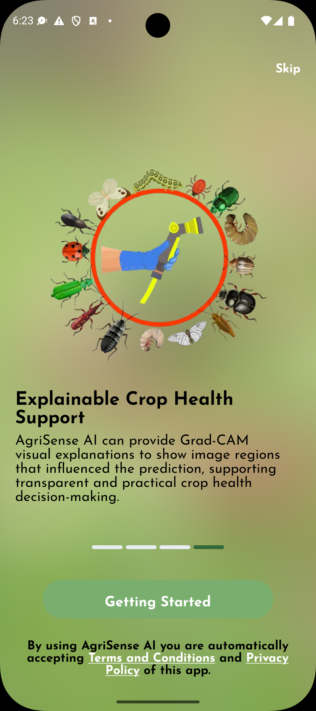
</p>

### Home and Settings

<p align="center">
  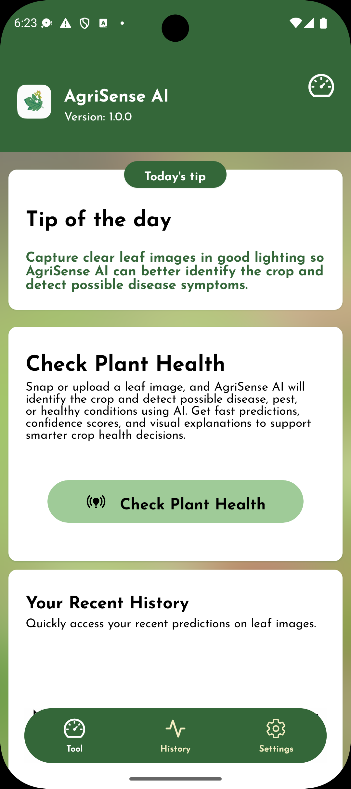
  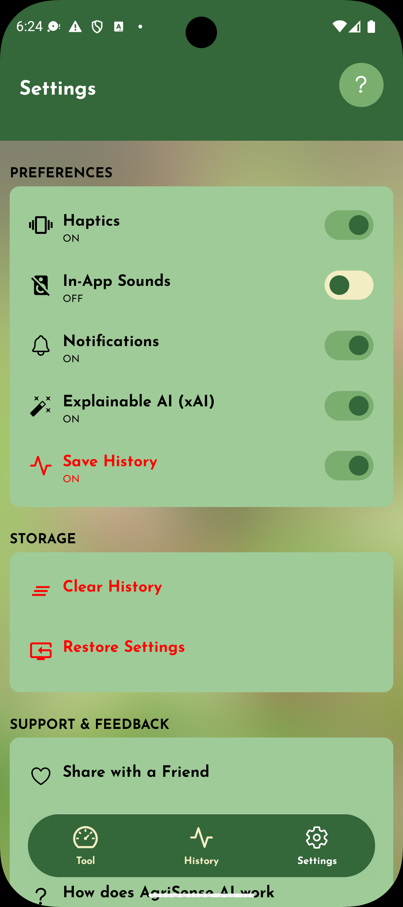
  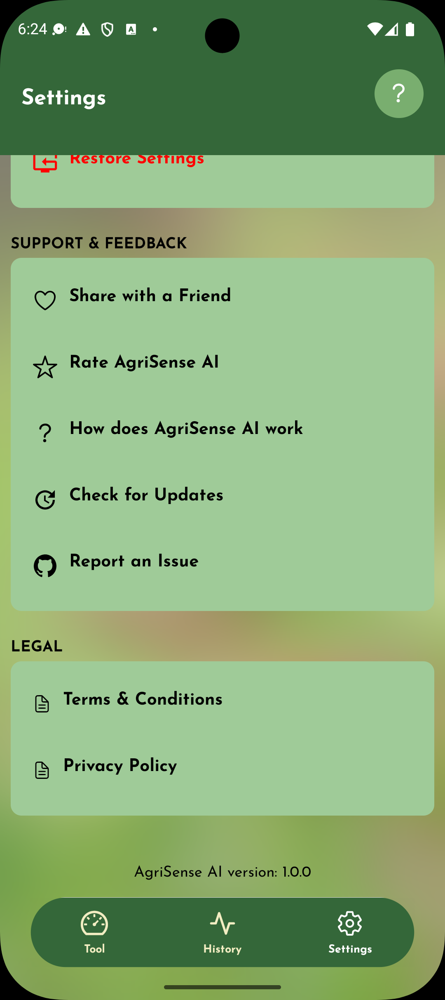
</p>

### Leaf Selection and Prediction

<p align="center">
  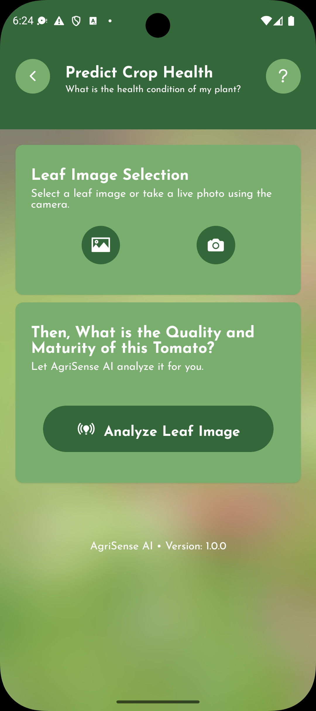
  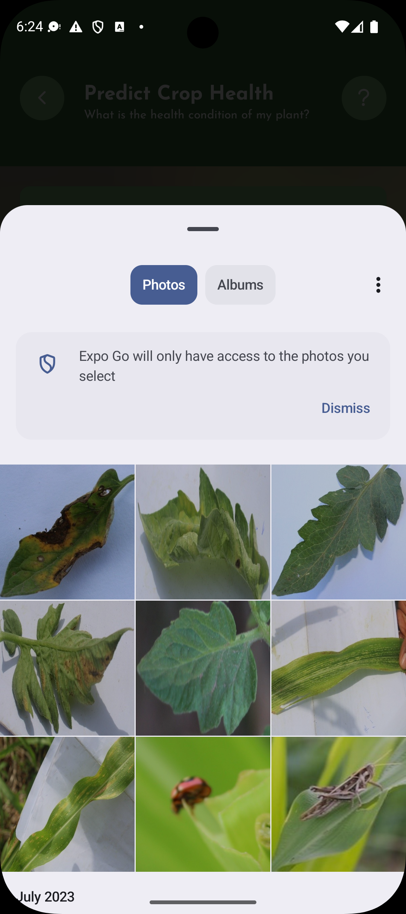
  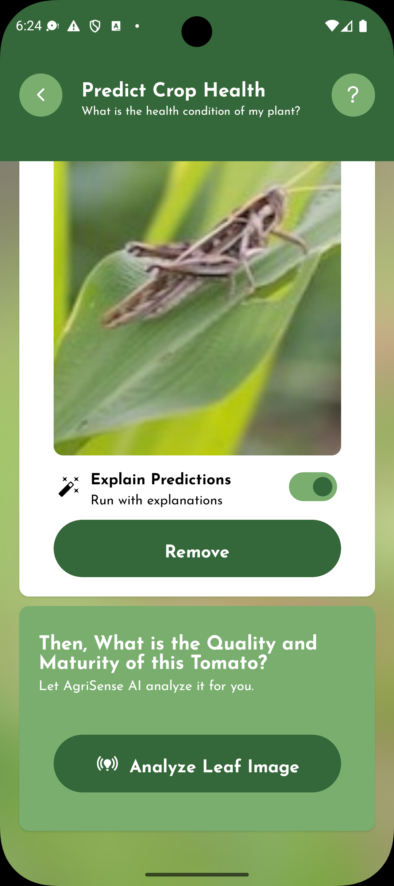
</p>

### Results and Explanations

<p align="center">
  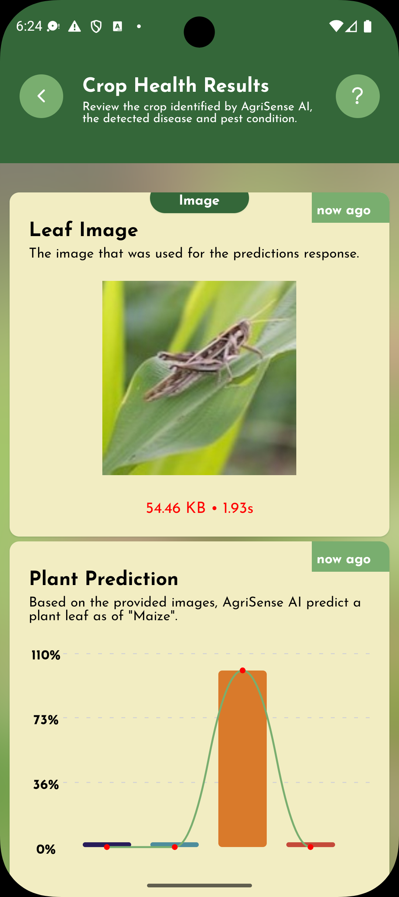
  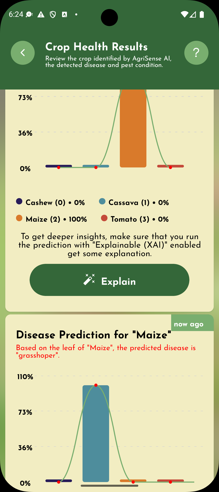
  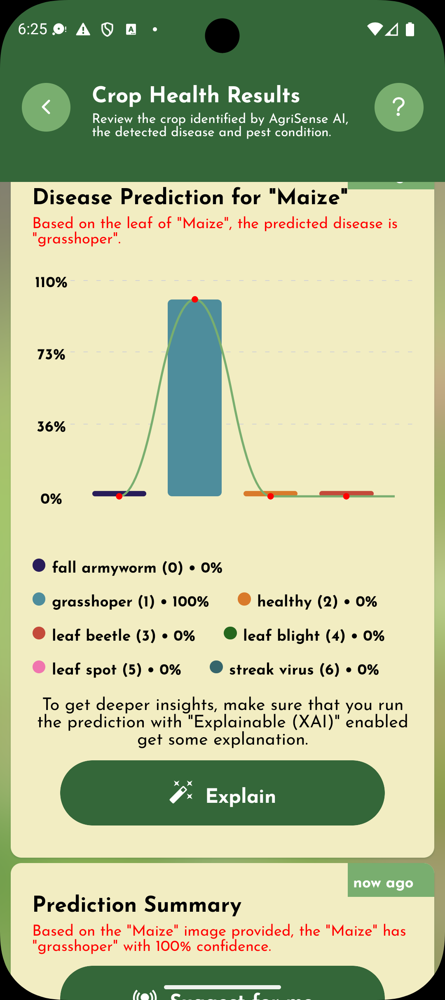
  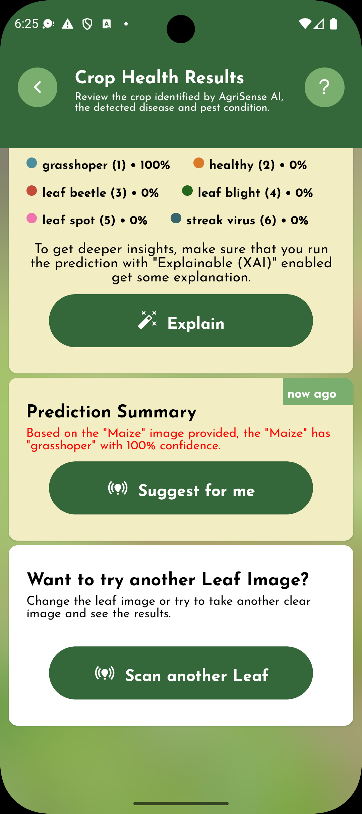
  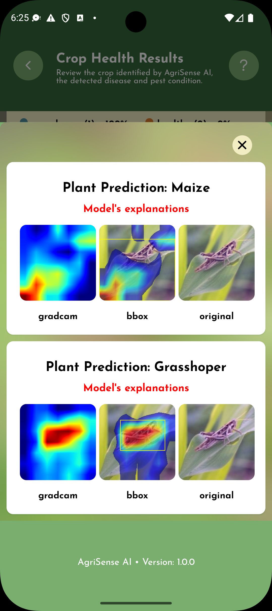
</p>

### History

<p align="center">
  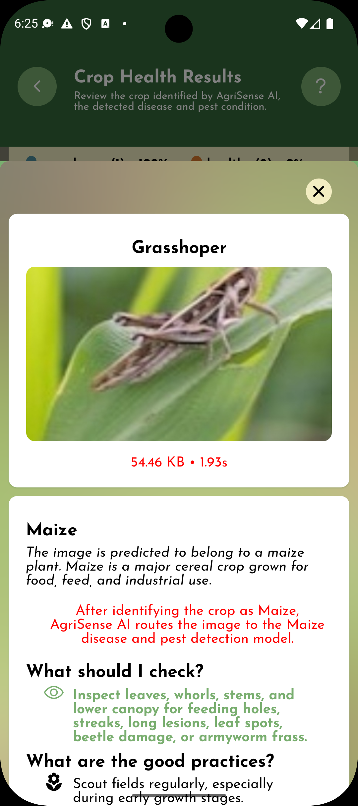
  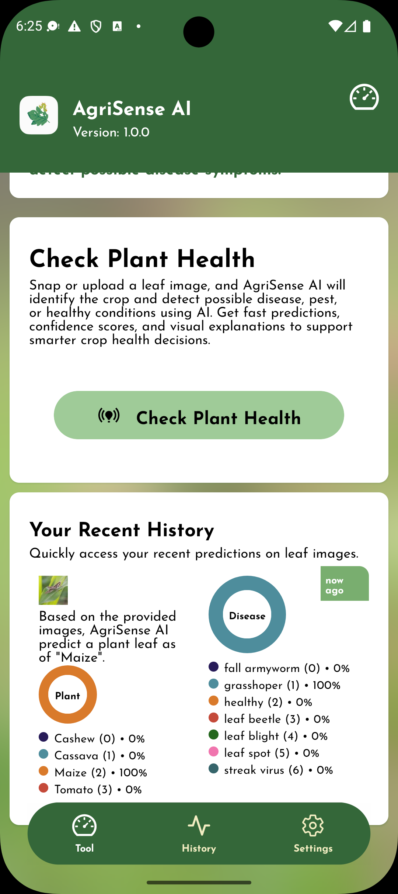
</p>

## 🛠️ Tech Stack

| Tool                           | Purpose                                   |
| ------------------------------ | ----------------------------------------- |
| React Native                   | Mobile app development                    |
| Expo                           | Development, build, and device testing    |
| TypeScript                     | Type-safe app logic                       |
| React Navigation / Expo Router | App navigation                            |
| TanStack Query                 | API request and mutation handling         |
| Async Storage / local storage  | Saving preferences and prediction history |
| Expo Image Picker              | Selecting images from gallery             |
| Expo Camera / Image Picker     | Capturing images                          |
| FastAPI backend                | AI inference server                       |

## 📂 Suggested Mobile Folder Structure

```text
mobile/
├── app/
│   ├── index.tsx
│   ├── settings/
│   ├── history/
│   └── predict/
├── assets/
│   ├── images/
│   └── icons/
├── components/
├── constants/
├── hooks/
├── lib/
├── providers/
├── types/
├── utils/
├── package.json
└── README.md
```

## 🚀 Getting Started

### 1. Install Dependencies

From the `mobile` directory, run:

```shell
npm install
```

or:

```shell
yarn install
```

### 2. Configure the API Base URL

Make sure the mobile app points to the running FastAPI backend.

For Android emulator:

```ts
const SERVER_BASE_URL = "http://10.0.2.2:8000/api/v1/crop";
```

For iOS simulator:

```ts
const SERVER_BASE_URL = "http://127.0.0.1:8000/api/v1/crop";
```

For a physical phone on the same Wi-Fi network:

```ts
const SERVER_BASE_URL = "http://192.168.1.50:8000/api/v1/crop";
```

Replace `192.168.1.50` with your computer's local IPv4 address.

### 3. Start the App

```shell
npx expo start
```

Then open the app using:

- Expo Go on a physical device
- Android emulator
- iOS simulator

## 🔌 Backend Requirement

The mobile app requires the AgriSense AI FastAPI server to be running.

From the root project:

```shell
cd server
uvicorn app:app --host 0.0.0.0 --port 8000
```

The backend should expose the prediction endpoint:

```http
POST /api/v1/crop/predict
```

## 📡 Prediction Request

The app sends a `multipart/form-data` request to the backend.

### Request Fields

| Field     | Type           | Required | Description                                  |
| --------- | -------------- | -------- | -------------------------------------------- |
| `image`   | File           | Yes      | Leaf image selected or captured by the user  |
| `explain` | Boolean string | No       | `"true"` enables Grad-CAM explanation images |

Example request from the app:

```ts
const formData = new FormData();

formData.append("image", image);
formData.append("explain", String(explain));

const res = await fetch(`${SERVER_BASE_URL}/predict`, {
  method: "POST",
  body: formData,
});
```

## ✅ Example API Response

```json
{
  "time": 1.36,
  "ok": true,
  "status": "ok",
  "prediction": {
    "plant_prediction": {
      "label": 2,
      "class_label": "Maize",
      "probability": 1.0
    },
    "disease_prediction": {
      "label": 1,
      "class_label": "grasshoper",
      "probability": 1.0
    },
    "pipeline": {
      "predicted_plant": "Maize",
      "selected_disease_model": "Maize MobileNetV3"
    },
    "explanation": {
      "gradcam": "maize_example_gradcam.png",
      "bbox": "maize_example_bbox.png",
      "original": "maize_example_original.png"
    }
  },
  "size": "54.46 KB"
}
```

## 🔍 Grad-CAM Explanation Images

When Explainable AI is enabled, the app displays explanation images returned by the backend.

The image URL format is:

```ts
`${SERVER_BASE_URL}/storage/gradcam/${filename}`;
```

Example:

```text
http://192.168.1.50:8000/api/v1/crop/storage/gradcam/maize_example_gradcam.png
```

The backend may return:

| Image      | Meaning                            |
| ---------- | ---------------------------------- |
| `original` | Original uploaded leaf image       |
| `gradcam`  | Grad-CAM heatmap                   |
| `bbox`     | Grad-CAM overlay with bounding box |

## ⚙️ Settings

The app includes settings for:

- Haptics
- In-app sounds
- Notifications
- Explainable AI
- Save history
- Clear history
- Restore settings
- Share app
- Rate app
- Report issue
- Terms and Conditions
- Privacy Policy

## 🕘 Prediction History

When history is enabled, the app saves recent prediction results so users can quickly review previous crop health checks.

A saved history item may include:

- Leaf image
- Plant prediction
- Disease or pest prediction
- Confidence scores
- Prediction time
- Grad-CAM explanation filenames, when available

## 🧪 Development Notes

### Clear Metro Cache

```shell
npx expo start --clear
```

### Run Type Checking

```shell
npx tsc --noEmit
```

### Install a Package

```shell
npx expo install package-name
```

## ⚠️ Important Notice

AgriSense AI is an agricultural decision-support tool. It does not replace expert agronomic advice, laboratory testing, or professional plant disease diagnosis. Results should be interpreted with field observation, local extension guidance, and good crop management practices.

## 📄 License

This project is licensed under the [MIT License](../LICENSE).
